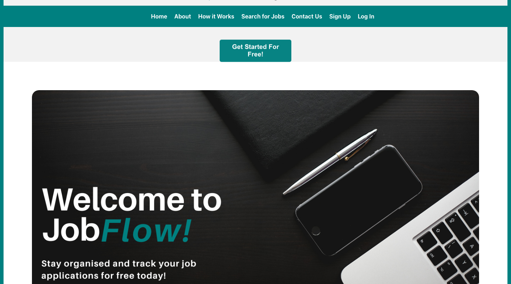
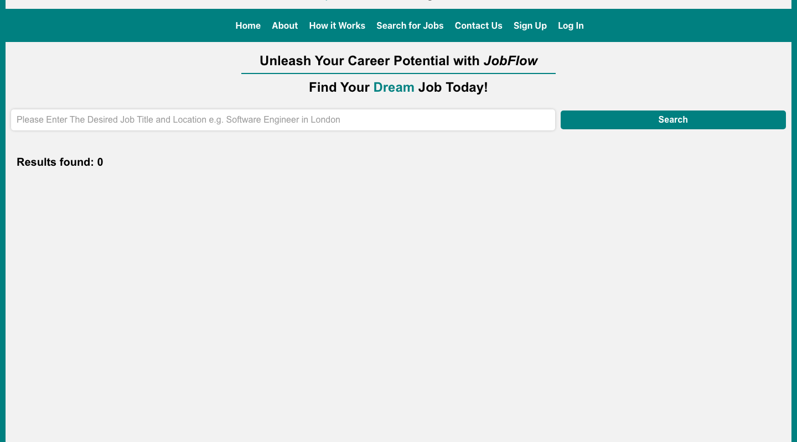
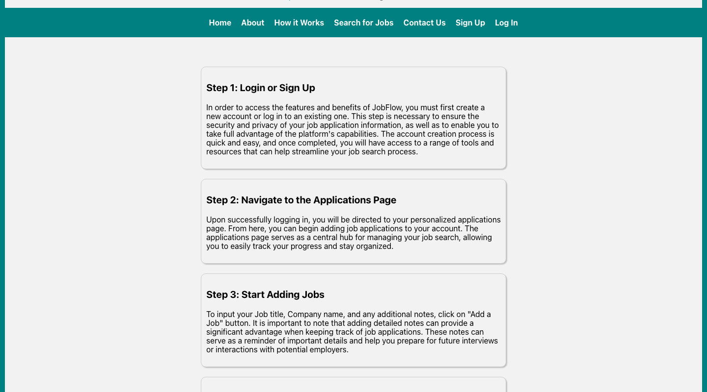

# JobFlow

**Stay organised and track your job applications.** JobFlow is a full-stack web app that gives job seekers one place to log every application, add notes and keep track of where each one stands, and to search live job listings without leaving the site.

Built by a team of five as a group project, from wireframes through to a tested React front end and a Node/Express API backed by MySQL. See the [contributors](https://github.com/oliviao12345/JobFlow/graphs/contributors) for the team, and the [project report](JobFlow%20Project%20Report.pdf) for the full write-up.

<p align="center"></p>

## What it does

- **Application tracker.** Sign up, then add each job with its title, company, status, salary, date applied and notes. Edit or delete entries any time.
- **Job details.** Open any application to see its details and a star rating.
- **Integrated job search.** Search by role and location (for example "Software Engineer in London") against live listings from the JSearch API.
- **Real accounts.** Sign-up and login run through Firebase Authentication. The tracker's API routes are protected, so users only reach their own data.
- **A guided "How it works" page,** plus About, Team and Contact pages with form validation.

<p align="center">
  
  
</p>

## Design and build choices

- **A clear teal-and-white identity** carries from the hero image through the nav, buttons and table headers.
- **Planned before it was built.** Page layouts were sketched first (see [`prototype/`](prototype)) and the front end follows them.
- **Component-per-feature front end.** Each feature lives in its own folder under `client/src/components` with its own styles, and routing is handled by React Router.
- **Layered API.** Express routes sit on Sequelize models, with an authentication middleware in front of the protected job routes.
- **Tested on both sides.** Jest and supertest cover the API routes, and React Testing Library covers the UI.

## Tech stack

| Layer | Tools |
| --- | --- |
| **Front end** | React 18, React Router 6, React Bootstrap, Axios, Font Awesome |
| **Back end** | Node.js, Express 4, Sequelize 6 (ORM), `mysql2` |
| **Database** | MySQL, hosted on Clever Cloud (optional) or run locally |
| **Auth** | Firebase Authentication (client) and Firebase Admin (API) |
| **External API** | [JSearch](https://rapidapi.com/letscrape-6bRBa3QguO5/api/jsearch/details) via RapidAPI |
| **Testing** | Jest, supertest, React Testing Library |
| **Design and planning** | draw.io wireframes, Postman |

## API overview

| Route | Methods | Auth |
| --- | --- | --- |
| `/api/users`, `/api/users/:UID` | GET, POST, DELETE | Public |
| `/api/contactus`, `/api/contactus/:id` | GET, POST, DELETE | Public |
| `/api/jobs`, `/api/jobs/:id` | GET, POST, PUT, DELETE | Firebase token required |

## Getting started

Requires **Node 16.4 or later** and **MySQL**.

1. **Create the database**

   ```sql
   CREATE DATABASE JobFlow;
   ```

2. **Start the API**

   ```bash
   cd api
   npm install
   npm start
   ```

   Create an `api/.env` file with your connection details: `HOST`, `DATABASE`, `DB_USER`, `DB_PASSWORD`, `DIALECT` (use `mysql`) and optionally `PORT`. You will also need your own Firebase service-account credentials for the API's token check. The API runs on <http://localhost:8080>.

3. **Start the client** (in a second terminal)

   ```bash
   cd client
   npm install
   npm start
   ```

   Open <http://localhost:3000>. Add your own Firebase web config in `client/src/firebase.js` and a RapidAPI key for the job search in `client/src/components/JobSearch/search.js`.

## Running the tests

```bash
cd api && npm test      # API tests (run against a local MySQL database)
cd client && npm test   # front-end tests
```

## Project layout

| Path | Contents |
| --- | --- |
| `client/` | React app: `components/` (one folder per feature), `pages/`, `context/` (auth), `__tests__/` |
| `api/` | Express API: `routes/`, `models/`, `tests/` |
| `prototype/` | Wireframes and flow diagram |
| `docs/` | README screenshots |

## What's next

Integration with other job boards, email notifications, application insights and a customisable dashboard, as outlined in the original wireframes.
